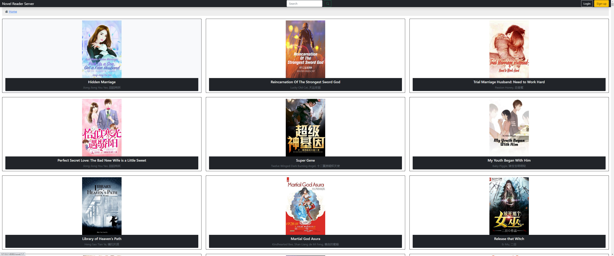
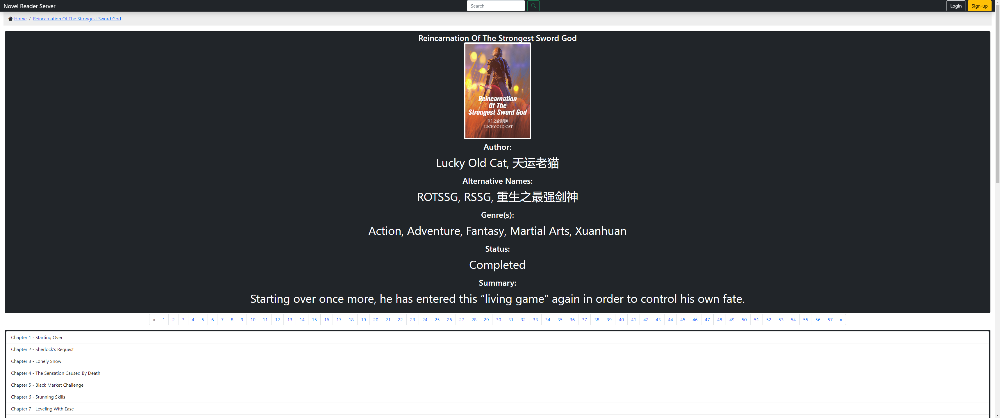
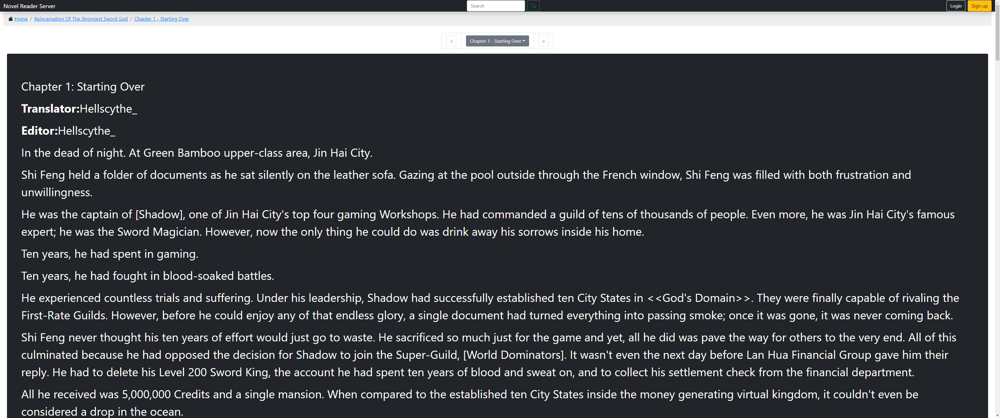

# Novel Reader Server
 A novel reader server written in D. No database is provided, you can use the builtin commands to build it, as the size is currently sitting at 3.0GB while still building chapter text database.

## Features

* Database builder from a source (Currently 1 parser included).
* Online reading from web server
* Account based novel/chapter tracking.

## Screenshots




## Configuration
Change Novel Reader Server binding addresses, port and api access via updating the novel_reader_server.cfg file.
```cfg
ipv4 = "127.0.0.1"
ipv6 = "::1"
port = 8080
api = false
```
 
## Why does this project exist?
 To learn D and implement a complete project that uses different technologies. Usually an example in a language is provided with barebone functionality and features.

## Additional Windows setup steps:
 Requires SQLite3.lib file to build and SQLite3.dll to run - https://gist.github.com/zeljic/d8b542788b225b1bcb5fce169ee28c55
